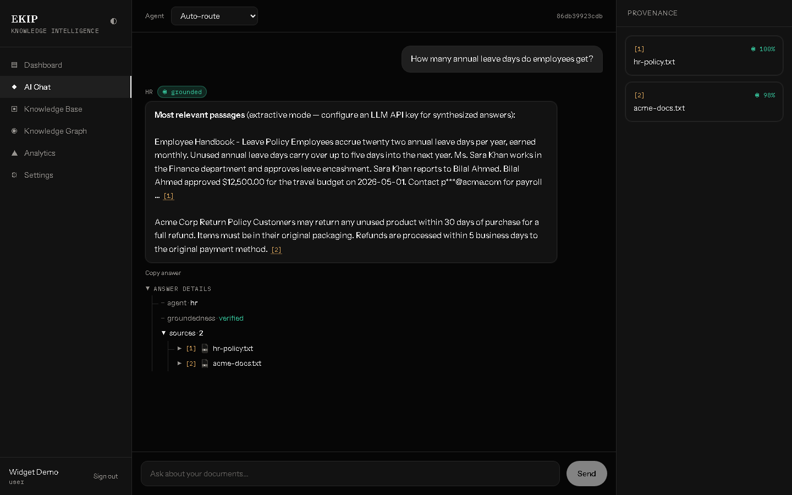
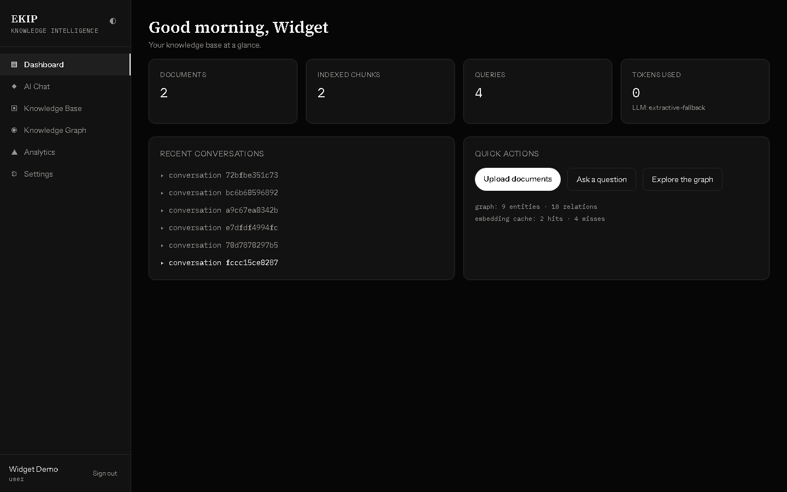
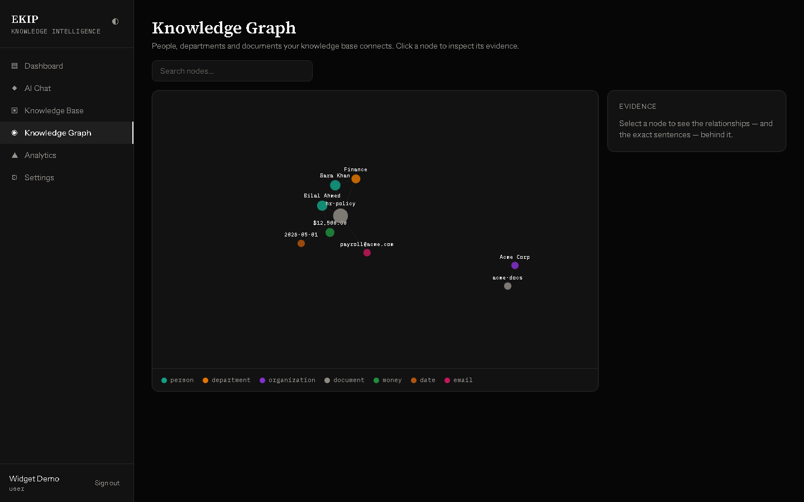
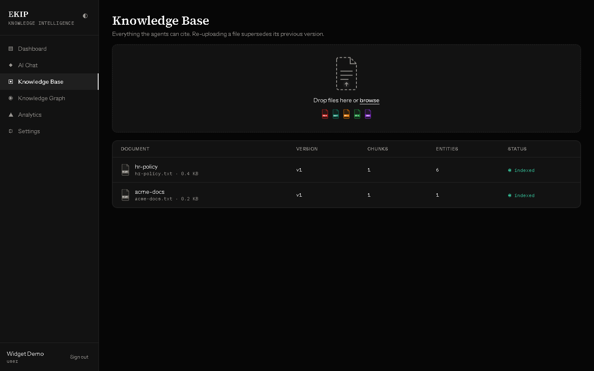
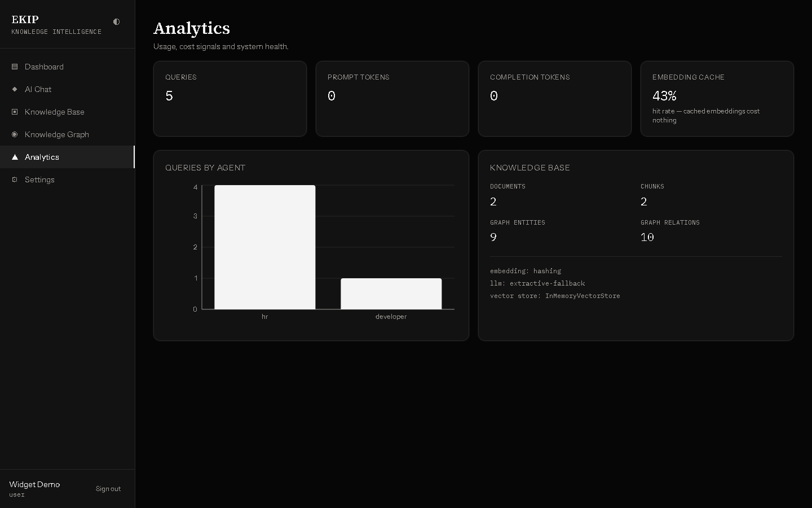
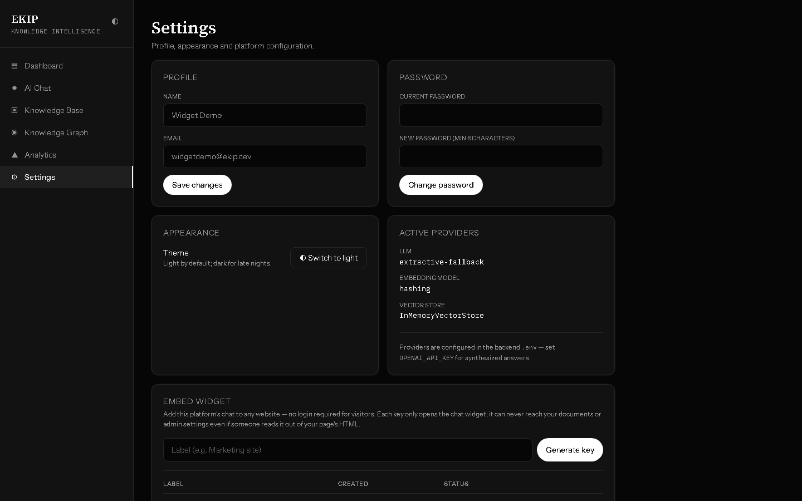
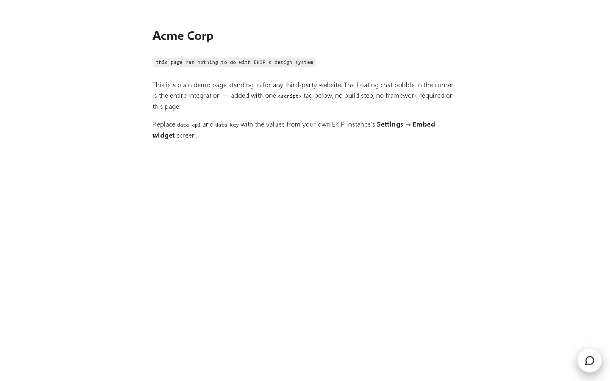

<div align="center">

# EKIP — Enterprise Knowledge Intelligence Platform

**Upload your documents. Ask questions. Get answers you can actually verify.**

[](https://github.com/Aittrah/enterprise-knowledge-platform/actions/workflows/ci.yml)


</div>

---

## What this is

Most "AI chatbot" projects let a language model answer from your documents and hope it's right. **EKIP doesn't hope — it proves.** Every answer streams back with numbered citations, and each one is mechanically checked against the exact passage it claims to come from. If the model can't support a claim, that claim is flagged, not hidden. If a question doesn't have an answer in your documents, the system says so instead of guessing.

Feed it PDFs, Word docs, spreadsheets, slide decks, scanned receipts, or HTML pages. It cleans and organizes the content, builds both a keyword index and a knowledge graph of the people, departments, and facts it finds, and answers questions through one of six specialized AI agents — routed automatically, or picked by hand.

<div align="center">

<p><em>Every answer carries a <b>groundedness seal</b> and an expandable <b>details tree</b> — the model's reasoning, laid bare, not just trusted.</em></p>
</div>

## Why it's built this way

| | |
|---|---|
| 🔍 **Hybrid retrieval** | Keyword search (BM25) catches exact terms like invoice numbers that pure AI-similarity search misses; both run together and get merged with a proven ranking-fusion algorithm. |
| 🕸️ **Knowledge graph reasoning** | Beyond plain search — the system can answer questions like *"what budget applies to this person?"* even when the budget document never mentions them by name, by following the relationship between the two through a graph. |
| 🛡️ **Guardrails, not vibes** | Every question is screened for prompt-injection and jailbreak attempts before it reaches the AI. Every answer is screened for leaked personal information and unsupported claims before it reaches you. |
| 🔌 **Embeddable anywhere** | Generate a scoped, revocable key and drop EKIP's chat onto *any other website* with one line of HTML — no visitor login, and that key can never touch your documents or admin settings even if it's copied out of the page source. |
| 💰 **Runs for free, upgrades for real** | With no API keys configured it still works end-to-end offline; add an OpenAI key later and the exact same code now writes real AI answers instead of quoting passages. |
| ✅ **Actually tested** | 285 automated backend tests, all offline (no API keys needed to run them), plus a green CI pipeline that lints, tests, and builds Docker images on every push. |

## See it in action

<table>
<tr>
<td width="50%"></td>
<td width="50%"></td>
</tr>
<tr>
<td align="center"><sub><b>Dashboard</b> — usage at a glance</sub></td>
<td align="center"><sub><b>Knowledge Graph</b> — click any node for its evidence</sub></td>
</tr>
<tr>
<td width="50%"></td>
<td width="50%"></td>
</tr>
<tr>
<td align="center"><sub><b>Knowledge Base</b> — drag, drop, indexed</sub></td>
<td align="center"><sub><b>Analytics</b> — usage, cost, and cache efficiency</sub></td>
</tr>
</table>

## Embed it on your own website

Every account can generate a key from **Settings → Embed widget** and drop EKIP's chat onto a completely unrelated site with a single line — no framework, no build step, no visitor login:

```html
<script src="https://your-ekip-host/widget/ekip-widget.js"
        data-api="https://your-ekip-host"
        data-key="<your widget key>"
        async></script>
```

<table>
<tr>
<td width="50%"></td>
<td width="50%"></td>
</tr>
<tr>
<td align="center"><sub>Generate and revoke keys from Settings</sub></td>
<td align="center"><sub>The <i>entire</i> integration, on someone else's site</sub></td>
</tr>
</table>

The widget bundle is framework-free (no React), renders in an isolated Shadow DOM so it can never clash with the host page's styling, and ships at **under 8 KB**. The key it uses is deliberately powerless outside of chat — see [docs/26-embeddable-widget.md](docs/26-embeddable-widget.md) for how that boundary is enforced and tested.

## Quickstart

```bash
git clone https://github.com/Aittrah/enterprise-knowledge-platform.git
cd enterprise-knowledge-platform

# Option A — full stack in Docker (Postgres+pgvector, Qdrant, Neo4j, Redis, MinIO)
cp .env.example .env
docker compose up -d              # → http://localhost:3000

# Option B — bare development (zero services, zero API keys required)
cd backend  && pip install -r requirements.txt && uvicorn app.api.main:create_app --factory
cd frontend && npm install && npm run dev    # → http://localhost:5173
```

Register the first account — it automatically becomes the admin. Upload a document, ask it a question, and watch the answer stream in with citations. Add `OPENAI_API_KEY` to `.env` whenever you want the AI to write full answers instead of quoting passages directly.

## How it fits together

```
React (TypeScript) ── WebSocket/REST ──▶ FastAPI ──▶ Guardrails ──▶ Agent Orchestrator
                                                                          │
                          Hybrid retrieval: Qdrant · pgvector · BM25 · reranking · Neo4j GraphRAG
                                                                          │
                       Ingestion pipeline: extract → OCR → clean → chunk → embed → build graph
```

Full architecture diagrams, data flow, and the reasoning behind each design decision live in [docs/02-architecture.md](docs/02-architecture.md).

## Built with

| Layer | Technology |
|---|---|
| Frontend | React 18, TypeScript, Tailwind CSS v4, Zustand, Recharts, vanilla-TS embeddable widget |
| Backend | FastAPI, Pydantic, WebSockets, SQLite/PostgreSQL |
| AI | Pluggable adapters for OpenAI, Cohere, Voyage, BGE, E5 — plus a keyless offline fallback |
| Retrieval | Qdrant, pgvector, BM25, cross-encoder/Cohere reranking, Neo4j knowledge graph |
| Operations | Docker, GitHub Actions CI/CD, Prometheus-compatible metrics, structured logging |

## Quality and process

This project was built the way a real product ships: **25 milestones**, each on its own reviewed feature branch, merged with a descriptive commit, and tagged at the end of every phase (`v0.1.0` → `v1.0.0`). Nothing was generated in one shot and left untested.

- **285 backend tests** — extractors, retrieval, agents, guardrails, the embeddable widget's security boundary — all runnable offline with zero API keys.
- **Continuous integration** on every push: lint, full test suite, strict TypeScript build, and Docker image publishing. [See it running.](https://github.com/Aittrah/enterprise-knowledge-platform/actions)
- **Deployment guide** for AWS, Azure, and GCP in [docs/24-deployment.md](docs/24-deployment.md).

## Documentation

Every milestone has a written design doc explaining *why*, not just *what*:

<details>
<summary><b>Data pipeline</b> — ingestion, OCR, cleaning, chunking</summary>

- [Requirements](docs/01-requirements.md) · [Architecture](docs/02-architecture.md)
- [Document ingestion](docs/04-document-ingestion.md) · [OCR pipeline](docs/05-ocr-pipeline.md)
- [Data cleaning](docs/06-data-cleaning.md) · [Chunking engine](docs/07-chunking-engine.md)
</details>

<details>
<summary><b>Knowledge base & retrieval</b> — embeddings through GraphRAG</summary>

- [Embedding pipeline](docs/08-embedding-pipeline.md) · [Vector database](docs/09-vector-database.md) · [Knowledge graph](docs/10-knowledge-graph.md)
- [Semantic search](docs/11-semantic-search.md) · [Hybrid search](docs/12-hybrid-search.md) · [Reranking](docs/13-reranking.md) · [GraphRAG](docs/14-graphrag.md)
</details>

<details>
<summary><b>AI layer & application</b> — prompts, agents, memory, API, frontend</summary>

- [Prompt engineering](docs/15-prompt-engineering.md) · [Multi-agent system](docs/16-multi-agent-system.md) · [Memory system](docs/17-memory-system.md)
- [FastAPI backend](docs/18-fastapi-backend.md) · [React frontend](docs/19-frontend.md) · [Embeddable widget](docs/26-embeddable-widget.md)
</details>

<details>
<summary><b>Trust, ops & delivery</b> — guardrails, evaluation, deployment</summary>

- [AI guardrails](docs/20-ai-guardrails.md) · [Evaluation & observability](docs/22-evaluation-framework.md)
- [CI/CD & deployment](docs/24-deployment.md) · [Portfolio notes](docs/25-portfolio-notes.md) · [Design system](docs/design/design-system.md)
</details>

## License

MIT — built by **Aittrah Sardar** as a flagship portfolio project.
