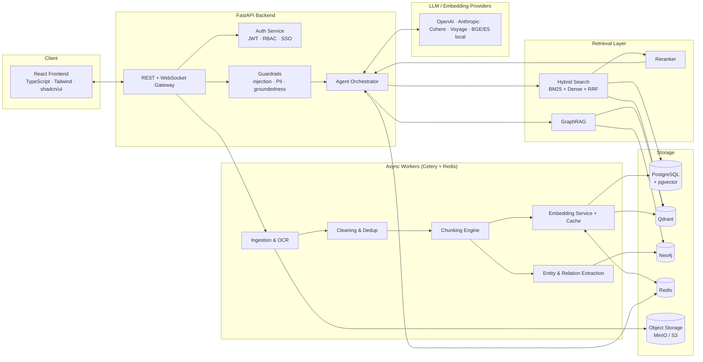
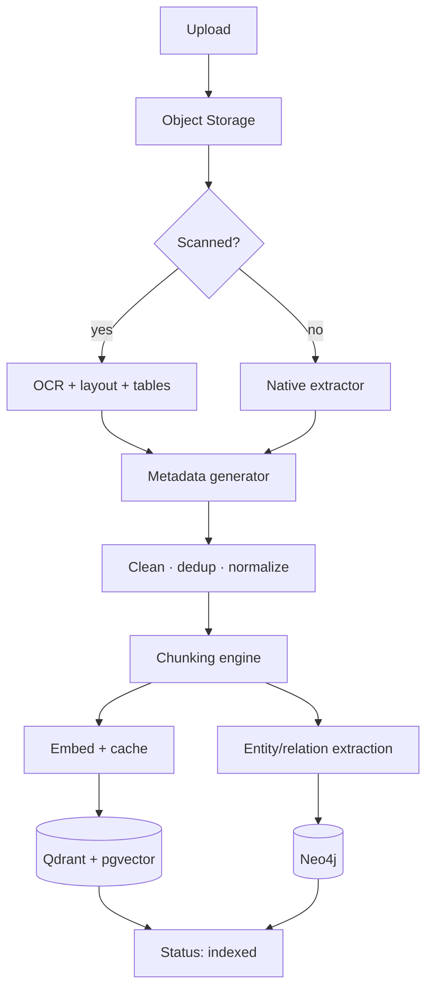
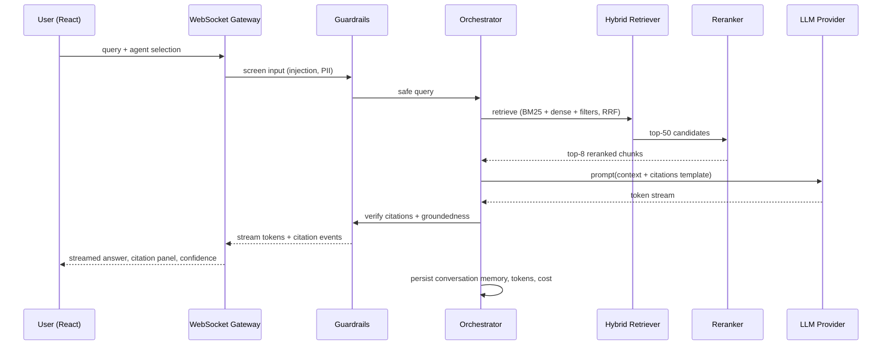
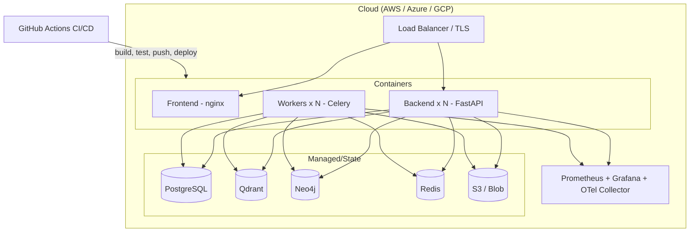

# Milestone 2 — System Architecture

**Project:** Enterprise Knowledge Intelligence Platform (EKIP)
**Status:** Approved baseline · Phase 1

Diagrams are authored in Mermaid so they render directly on GitHub; editable draw.io copies can be exported from these definitions.

---

## 1. High-Level Architecture



## 2. Low-Level Architecture (backend modules)

```
backend/app/
├── api/                # FastAPI routers: auth, documents, chat, search, graph, analytics, admin
├── core/               # config, security, logging, exceptions, rate limiting
├── ingestion/          # extractors (pdf, docx, txt, html, csv, pptx), ocr/, metadata, versioning
├── processing/         # cleaning, dedup, normalization, chunking strategies
├── embeddings/         # provider adapters (openai, bge, e5, voyage, cohere), cache
├── stores/             # qdrant_store, pgvector_store, neo4j_store, object_store
├── retrieval/          # dense, bm25, hybrid_rrf, reranker, graphrag
├── agents/             # base agent, router, hr, finance, research, developer, legal, operations
├── memory/             # conversation, long_term, user, project memory
├── prompts/            # prompt templates, citation formats, structured output schemas
├── guardrails/         # injection, jailbreak, pii, citation_verify, groundedness
├── evaluation/         # metrics, golden datasets, runners
├── observability/      # structured logs, metrics, tracing, token/cost tracking
├── workers/            # celery tasks: ingest, embed, graph_build, evaluate
└── models/             # SQLAlchemy models + Pydantic schemas
```

Key design decisions (ADR summaries):

| # | Decision | Rationale |
|---|---|---|
| ADR-1 | **FastAPI + Celery** over a single sync app | OCR/embedding are long-running; request path stays fast |
| ADR-2 | **Qdrant primary, pgvector secondary** | Qdrant for scale/filtering; pgvector keeps a SQL-joinable copy for analytics and as fallback |
| ADR-3 | **Provider adapter pattern** for LLM/embeddings | Swap providers per-tenant/per-cost without touching callers |
| ADR-4 | **RRF for hybrid fusion** | No score calibration needed between BM25 and cosine spaces |
| ADR-5 | **Citations = chunk IDs, verified server-side** | Guardrail can prove every citation resolves to retrieved content |
| ADR-6 | **tenant_id everywhere + namespaced collections** | Multi-tenant isolation without separate deployments |

## 3. Data Flow — Ingestion



## 4. Sequence Diagram — Cited chat query



## 5. Component Diagram — Frontend

```
frontend/src/
├── app/            # router, providers (React Query, Zustand, theme)
├── components/ui/  # shadcn/ui primitives + design-system components
├── components/     # Sidebar, TopNav, ChatWindow, MessageBubble, DocumentCard,
│                   # SearchBar, StatCard, DataTable, Modal, Toast, Timeline,
│                   # GraphViewer, Charts, FileUploadZone, Breadcrumbs
├── features/       # auth, dashboard, chat, knowledge-base, graph, analytics, admin, settings
├── lib/            # api client, ws client, utils
└── stores/         # zustand slices: session, chat, ui
```

## 6. Deployment Diagram



Local development mirrors this via `docker-compose.yml` (all stores + API + frontend).

---

*Next milestone: [03-repository-setup](../README.md)*
